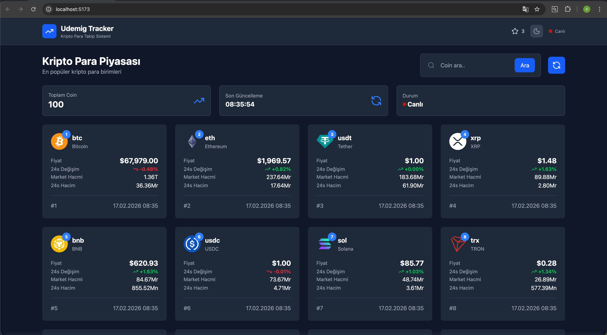

# 🪙 Crypto Exchange

Gerçek zamanlı verilerle kripto para piyasasını takip etmeyi sağlayan, performans odaklı ve modern bir React uygulamasıdır. Uygulama, kullanıcıların piyasadaki güncel durumu izlemesine ve detaylı grafik analizlerine ulaşmasına olanak tanır.

## 🎯 Projenin Amacı

Kripto para birimlerine ait anlık fiyatları, piyasa hacimlerini ve geçmişe dönük fiyat değişimlerini tek bir merkezden, kullanıcı dostu bir arayüzle sunmak. Veri tutarlılığını sağlamak için otomatik ve manuel yenileme mekanizmalarını bir arada kullanır.

## 🛠️ Kullanılan Teknolojiler

- React: Bileşen tabanlı kullanıcı arayüzü ve Custom Hook mimarisi.

- Tailwind CSS: Modern, responsive ve hızlı stil yönetimi.

- React Router Dom: Sayfalar arası hızlı ve akıcı geçiş yönetimi.

- Axios: API isteklerini yönetmek için kullanılan promise tabanlı HTTP istemcisi.

- Chart.js & React-Chartjs-2: Verileri görselleştirmek ve interaktif grafikler sunmak için.

- Lucide React: Uygulama içi modern ikon seti.

## 📡 API Entegrasyonu ve Canlı Veri

Uygulama, verilerini dünyanın en kapsamlı kripto veri sağlayıcılarından biri olan CoinGecko API üzerinden çekmektedir.

Anlık Veri: Piyasa değeri bazında ilk 100 coin’in güncel fiyatı, 24 saatlik değişimi ve toplam hacmi listelenir.

Detaylı Analiz: Her bir coin için 24 saatlikten 1 yıla kadar değişen periyotlarda fiyat geçmişi çekilerek grafik üzerinde görselleştirilir.

## 🔄 Dinamik Yetenekler (Refresh & Auto-Update)

Proje, veri güncelliğini korumak için iki katmanlı bir yapı sunar:

Otomatik Yenileme: useCoins hook'u içerisinde kurulan setInterval mekanizması sayesinde, her 30 saniyede bir arka planda veriler otomatik olarak güncellenir.

Manuel Yenileme: Kullanıcı dilerse "Refresh" butonu aracılığıyla API'ye manuel istek göndererek verileri anında tazeleyebilir.

Filtreleme: Uygulama içerisindeki arama barı sayesinde, çekilen veriler arasından hem isim hem de sembol (BTC, ETH vb.) bazında useMemo ile optimize edilmiş anlık filtreleme yapılabilir.

## ✨ Öne Çıkan Teknik Özellikler

Custom Hooks: API istekleri ve state yönetimi useCoins ve useCoinDetail gibi özel hook'lar ile soyutlanarak kod tekrarı önlendi.

Performance Optimization: Veri filtreleme işlemlerinde gereksiz render'ları önlemek için useMemo, fonksiyonlarda ise useCallback kullanıldı.

Responsive Tasarım: Tüm ekran boyutlarına (mobil, tablet, desktop) tam uyumlu responsive tasarım.

# Ekran Görüntüsü

# GIFs

